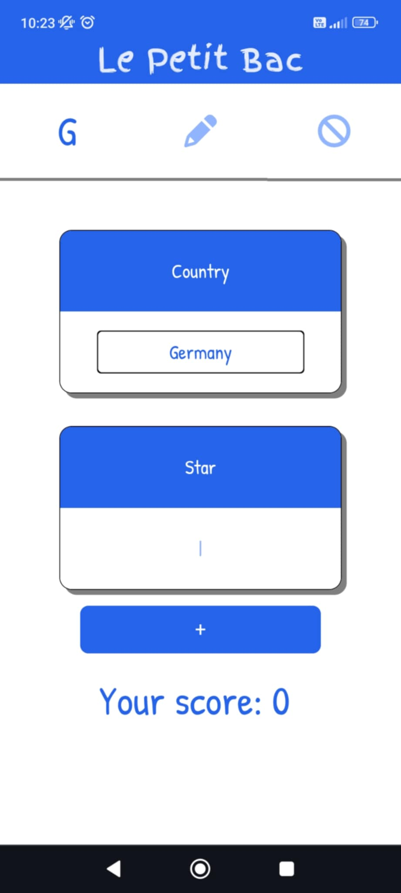
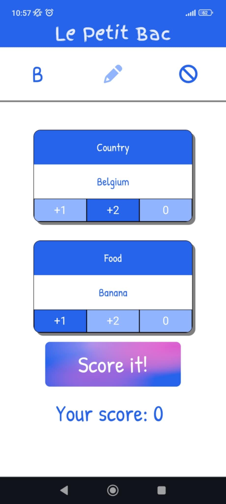

# Le Petit Bac

### 📝 About the Project

"Le Petit Bac" (also known as Baccalauréat, "Stop the Bus," or "Categories") is a classic word game: https://en.wikipedia.org/wiki/Categories_(game). This project is a simple, modern **Progressive Web App (PWA)** designed to make the game easier to play, especially when you're on the go with friends in the car. It handles the categories, letters, and scores, so you can focus on finding the best words!

  
  
  

---

### ⬇️ Installation

This application is built as a **Progressive Web App (PWA)**, which means you can install it directly onto your device, whether it's a phone or a computer. For development and testing purposes, the most straightforward installation method involves using **ngrok** and the **`serve` npm package**.

Here's how to install the PWA:

1.  **Download ngrok:** Visit the [ngrok website](https://ngrok.com/) and follow their instructions to install it on your system.
2.  **Install the `serve` package:** Open your command line or terminal and run `npm install -g serve`. The `-g` stands for "global," allowing you to use `serve` from any directory.
3.  **Start the local server:** Navigate to the root folder of this project in your terminal. Then, run `npm run serve`. This command will start a local web server for the application.
4.  **Expose your app online with ngrok:** In your terminal, run `ngrok http <port_number>`. Replace `<port_number>` with the port number that the `npm run serve` command indicated (e.g., 3000, 5000). Ngrok will provide a temporary public URL for your application.

Finally, open the URL provided by ngrok in your web browser. While viewing the application, go into your browser's settings or menu (often represented by three dots or lines) and look for an option like "Add to Home Screen," "Install app," or "Download app" to install the PWA.

#### know install inssues

If the 'Install app' button isn't visible in Chrome's menu, you can often trigger it manually. First, add the website shortcut to your home screen using the 'Add to Home screen' option. Then, refresh the page. Chrome should now display the install banner at the bottom of the screen, allowing you to install the app.

--- 

### ✨ Features

* **Offline-first PWA:** Play anywhere, anytime, without an internet connection.
* **Dynamic Categories:** Easily add or remove categories to customize your game.
* **Automatic Letter Generation:** Get a new letter with a single tap.
* **Score Tracking:** Keep a record of your points.
* **Translations:** Available in many languages. [TODO]

---

### 🔧 Technologies Used

* **Vue 3:** For building the user interface.
* **Vite:** A fast build tool for modern web projects.
* **HTML & CSS:** Standard web technologies for structure and styling.
